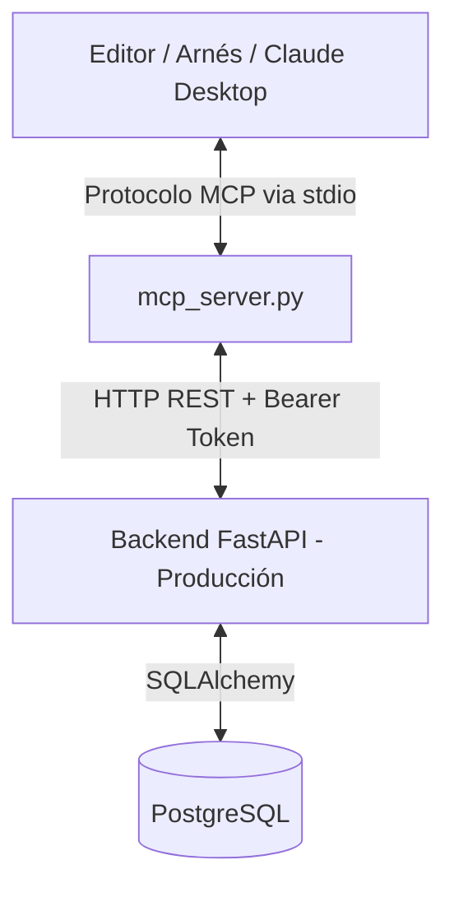

# Plan de Implementación: Servidor MCP para Gestor de Proyectos TI

Este plan detalla el diseño y la integración de un servidor de **Model Context Protocol (MCP)** para permitir que tus arneses de programación y asistentes de IA (como Claude Desktop, Cursor, etc.) interactúen directamente con el módulo de gestión de actividades y desarrollos del **Gestor de Proyectos TI** mediante autenticación con tokens de larga duración.

---

## 🏗️ 1. Arquitectura de la Solución

El servidor MCP actuará como un puente entre la herramienta de IA (Host MCP) y el backend de producción. Para garantizar la seguridad sin exponer contraseñas principales, la comunicación utilizará **Tokens JWT de larga duración** firmados con la `JWT_SECRET_KEY` del proyecto.



---

## 📂 2. Estructura de Archivos a Crear

Crearemos los siguientes archivos dentro de la carpeta `scripts/` del proyecto:

1. **[generar_token_mcp.py](file:///C:/Users/amejoramiento6/Gestor-de-proyectos-Ti/scripts/generar_token_mcp.py)**: Script local para generar un token JWT con vigencia de 10 años firmado con la clave del portal.
2. **[mcp_server.py](file:///C:/Users/amejoramiento6/Gestor-de-proyectos-Ti/scripts/mcp_server.py)**: Implementación del servidor MCP usando la SDK oficial de python `mcp` expuesta como CLI de entrada/salida estándar (stdio).
3. **[README_MCP.md](file:///C:/Users/amejoramiento6/Gestor-de-proyectos-Ti/docs/README_MCP.md)**: Guía detallada de uso, instalación y configuración del servidor MCP.

---

## 🛠️ 3. Herramientas MCP a Exponer (Tools)

El servidor MCP expondrá las siguientes funciones a los modelos de lenguaje:

| Herramienta | Argumentos | Descripción |
|---|---|---|
| `listar_desarrollos` | Ninguno | Obtiene la lista de proyectos/desarrollos activos con sus IDs y nombres. |
| `listar_tareas` | `desarrollo_id` (str), `estado` (opcional), `responsable_id` (opcional) | Lista las actividades (WBS) asociadas a un desarrollo específico. |
| `crear_tarea` | `desarrollo_id` (str), `titulo` (str), `descripcion` (opcional), `parent_id` (opcional, int), `horas_estimadas` (opcional) | Crea una nueva actividad dentro de un desarrollo. |
| `actualizar_tarea` | `actividad_id` (int), `estado` (opcional), `porcentaje_avance` (opcional), `horas_reales` (opcional), `seguimiento` (opcional) | Modifica el progreso, horas o estado de una actividad existente. |
| `registrar_bitacora` | `desarrollo_id` (str), `descripcion` (str), `categoria` (str) | Registra una actividad en el historial de eventos del desarrollo. |

---

## 🔑 4. Generación de Token JWT de Larga Duración

El script `generar_token_mcp.py` se encargará de:
- Cargar la variable `JWT_SECRET_KEY` y `ALGORITHM` de tu `.env`.
- Solicitar la cédula del usuario y el rol (p. ej., `admin` o `usuario`).
- Generar un token con expiración establecida a 10 años a partir del momento actual.
- Imprimir la cadena en formato Bearer JWT.

---

## ⚙️ 5. Configuración del Cliente MCP

Una vez generado el token, se configurará en el cliente de producción (p. ej., Claude Desktop en `%APPDATA%\Claude\claude_desktop_config.json`):

```json
{
  "mcpServers": {
    "gestor-proyectos-ti": {
      "command": "uv",
      "args": [
        "run",
        "--with", "mcp",
        "--with", "httpx",
        "--with", "python-jose[cryptography]",
        "scripts/mcp_server.py"
      ],
      "env": {
        "GPM_API_URL": "https://tu-dominio-produccion.com/api/v2",
        "GPM_TOKEN": "TU_TOKEN_JWT_GENERADO_DE_LARGA_DURACION"
      }
    }
  }
}
```

---

## 🚀 6. Siguientes Pasos

1. **Aprobación del Plan**: Por favor, revisa el plan.
2. **Generar script del Token**: Crearemos `scripts/generar_token_mcp.py` y lo probaremos.
3. **Generar script del Servidor MCP**: Crearemos `scripts/mcp_server.py`.
4. **Validación**: Comprobaremos que los arneses se conecten correctamente a la API del Gestor TI.
