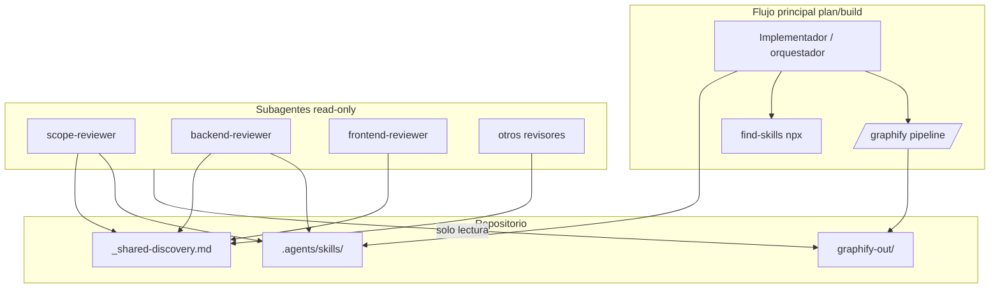

# Plan — Metaconocimiento del arnés OpenCode (skills, graphify, find-skills)

**Fecha:** 2026-06-02  
**Plan:** opencode-agentes-descubrimiento-skills  
**Autor del plan:** Cursor (recomendación de revisión de arnés)  
**Modo:** plan  
**Proyecto:** Gestor-de-proyectos-Ti  

---

## 1. Objetivo

Dotar al arnés de subagentes (`.opencode/agent/`) de un **protocolo explícito de descubrimiento y uso de capacidades**, sin duplicar lógica en cada revisor:

1. Centralizar reglas en un artefacto compartido (`_shared-discovery.md`).
2. Cablear los **skills de proyecto** que hoy existen en `.agents/skills/` pero no están referenciados por ningún subagente.
3. Definir roles claros para **graphify** (exploración / consumo de grafo) y **find-skills** (ecosistema externo, solo flujo principal).
4. Actualizar `AGENTS.md` y, si aplica, un ADR durable para que plan/build y revisores compartan el mismo contrato.

**Criterio de éxito:** un implementador o orquestador puede seguir el plan y, tras ejecutarlo, cada subagente sabe *cuándo* leer un skill del repo, *cuándo* recomendar find-skills, y *cuándo* usar artefactos de graphify — sin ejecutar pipelines prohibidos por permisos.

---

## 2. No-objetivos

- No instalar ni ejecutar `/graphify` sobre todo el monorepo en esta tarea (opcional, fase 3).
- No añadir `find-skills` ni `graphify` como dependencias npm/pip del producto.
- No cambiar permisos de subagentes read-only (`edit: deny`) salvo documentar excepciones (`bash: ask` donde ya exista).
- No reescribir el contenido de los 17 skills existentes; solo enlazarlos y protocolizar su uso.
- No modificar lógica de negocio en `backend_v2/` ni `frontend/`.

---

## 3. Archivos / módulos afectados

| Área | Archivos |
|------|----------|
| Arnés OpenCode | `.opencode/agent/_shared-discovery.md` (nuevo) |
| Subagentes | `.opencode/agent/*.md` (8 existentes + referencia al shared) |
| Documentación raíz | `AGENTS.md` |
| Decisiones | `docs/decisions/ADR-006-protocolo-descubrimiento-agentes.md` (nuevo, opcional pero recomendado) |
| Bitácora | `docs/bitacora/2026-06-02-opencode-descubrimiento-skills.md` (al cerrar build) |
| Índice arquitectura | `docs/architecture/README.md` (mención a graphify-out si se genera en fase 3) |
| Grafo (fase opcional) | `graphify-out/` (generado, no versionar en git salvo política explícita) |

**No afecta:** `backend_v2/`, `frontend/`, `testing/backend/` (salvo tests del arnés si se añaden más adelante).

---

## 4. Pasos de implementación

### Fase 1 — Protocolo compartido (prioridad alta)

**4.1** Crear `.opencode/agent/_shared-discovery.md` con:

```markdown
## Protocolo de descubrimiento (todos los subagentes)

### 1. Skills de proyecto (obligatorio explorar si el dominio no está claro)
- Ruta: `.agents/skills/*/SKILL.md`
- Leer la descripción YAML (`name`, `description`) antes de profundizar.
- Respetar siempre los "Mandatory references" del subagente actual.

### 2. Skills obligatorios por subagente
- Listados en cada `.opencode/agent/<nombre>.md`; tienen prioridad sobre descubrimiento ad hoc.

### 3. graphify (consumo vs ejecución)
- Si existe `graphify-out/GRAPH_REPORT.md` o `graphify-out/graph.json`: usar para impacto cruzado entre módulos.
- Subagentes con `bash: deny` NO ejecutan `/graphify`; solo leen artefactos ya generados.
- El flujo principal (plan/build/implementación) puede ejecutar `/graphify` en alcances grandes o módulos desconocidos.

### 4. find-skills (solo flujo principal)
- Subagentes read-only pueden RECOMENDAR: "no hay skill de proyecto para X; el orquestador puede usar find-skills (`npx skills find <query>`)".
- No instalar skills sin confirmación del usuario.

### 5. Orden de resolución
1. Mandatory references del subagente
2. Barrido de `.agents/skills/` por palabras clave del alcance
3. `graphify-out/` si existe
4. Recomendación find-skills al orquestador (no ejecución)
```

**4.2** En cada `.opencode/agent/<agente>.md`, añadir tras el frontmatter YAML:

```markdown
Include protocol: `.opencode/agent/_shared-discovery.md`
```

*(Si OpenCode no soporta include literal, copiar un bloque de 5 líneas que apunte al archivo shared y ordene leerlo al inicio.)*

---

### Fase 2 — Cableado de skills huérfanos (prioridad alta)

Matriz objetivo **skill → subagente(s)**:

| Skill (`.agents/skills/`) | Subagente(s) | Acción |
|---------------------------|--------------|--------|
| `skill_sdd_riper` | `scope-reviewer` | Añadir a Mandatory references |
| `skill_clean_architecture` | `scope-reviewer`, `backend-reviewer`, `frontend-reviewer` | Añadir |
| `skill_ux_expert` | `frontend-reviewer` | Añadir |
| `skill_devops_master` | `security-rbac-reviewer` | Añadir (compose, env, despliegue) |
| `skill_commit_convention` | `docs-tests-reviewer` | Añadir |
| `skill_tech_debt_cleaner` | `scope-reviewer` (opcional en build) | Añadir como referencia opcional |
| `skill_git_controlled_push` | — | Solo en `AGENTS.md` / flujo principal (no revisores) |
| `skill_error_analysis` | Ya en `docs-tests-reviewer` | — |
| Resto ya cableados | backend, frontend, security, docs-tests | Verificar sin duplicar |

**4.3** Completar `scope-reviewer.md`:

- Mandatory references: `skill_sdd_riper`, `skill_clean_architecture`, `skill_tech_debt_cleaner` (opcional).
- Checklist: "¿Se identificaron skills de proyecto aplicables vía protocolo shared?"

**4.4** Completar `harness-router.md`:

- Tras leer `.opencode/memory/harness-router.json`, sugerir al flujo principal: "si alcance > 3 módulos sin grafo, considerar graphify antes de revisores".
- Sin ejecutar bash; solo texto en salida bajo `Riesgos:`.

**4.5** Completar `mobile-reviewer.md`:

- Nota: no hay `skill_mobile_*` en repo; checklist explícito "sin skill móvil dedicado — basarse en INSTRUCCIONES_FORK y ARQUITECTURA_FRONTEND".

---

### Fase 3 — graphify operativo (prioridad media, opcional)

**4.6** Decisión de producto: ¿versionar `graphify-out/`?

- **Recomendación:** no commitear; documentar en `.gitignore` si no está.
- Alternativa: commitear solo `GRAPH_REPORT.md` resumido (más pesado de mantener).

**4.7** Ejecutar una vez (flujo principal, fuera de subagentes):

```bash
# Desde raíz del repo, con graphify instalado globalmente o vía skill
/graphify . --no-viz
# o pipeline mínimo documentado en .agents/skills/graphify o skill de usuario
```

**4.8** Documentar en `AGENTS.md` sección "Exploración del codebase":

- Cuándo correr graphify (refactors grandes, onboarding, auditorías).
- Ruta de salida esperada: `graphify-out/GRAPH_REPORT.md`.

**4.9** Añadir en `error-memory.md`:

- Operación opcional `lookup graphify <concepto>`: leer GRAPH_REPORT si existe; si no, indicar "grafo no generado".

---

### Fase 4 — find-skills y orquestador (prioridad media)

**4.10** Ampliar `AGENTS.md` → sección **Skills**:

```markdown
### Skills de proyecto
`.agents/skills/` — usar según dominio (ver cada SKILL.md).

### Descubrimiento externo (solo orquestador / implementación)
- Skill `find-skills`: `npx skills find <query>` cuando no exista skill local.
- No instalar sin confirmación del usuario.

### Protocolo del arnés
Ver `.opencode/agent/_shared-discovery.md` y ADR-006 (si existe).
```

**4.11** Si existe documentación del flujo opencode (plan/build), añadir paso explícito:

> Antes de invocar revisores en alcance amplio: barrido de `.agents/skills/` + graphify si aplica.

*(Ubicación: `docs/GUIA_DESARROLLO.md` o README de `.opencode/` si se crea.)*

---

### Fase 5 — ADR y cierre documental (prioridad baja)

**4.12** Crear `docs/decisions/ADR-006-protocolo-descubrimiento-agentes.md`:

- Contexto: revisores con skills parciales; AGENTS.md genérico.
- Decisión: protocolo shared + roles graphify/find-skills.
- Consecuencias: mantenimiento al añadir skills nuevos (actualizar matriz fase 2).

**4.13** Bitácora al completar build: `docs/bitacora/2026-06-02-opencode-descubrimiento-skills.md`.

---

## 5. Comandos de validación

No hay pytest de producto. Validación manual/checklist:

| # | Verificación | Comando / acción |
|---|--------------|------------------|
| 1 | Existe protocolo shared | `Test-Path .opencode/agent/_shared-discovery.md` |
| 2 | Los 8 agentes referencian shared | Buscar `_shared-discovery` en `.opencode/agent/*.md` |
| 3 | scope-reviewer lista ≥3 skills | Revisión manual del md |
| 4 | AGENTS.md menciona protocolo | `Select-String -Path AGENTS.md -Pattern "_shared-discovery"` |
| 5 | (Opcional) graphify-out | `Test-Path graphify-out/GRAPH_REPORT.md` |
| 6 | Sin secretos en diffs | Revisar que no se toque `.env` |

**Smoke test de orquestación (manual):**

1. Pedir a `harness-router` matriz para cambio que toque `backend_v2/` + `docs/`.
2. Confirmar que la salida menciona riesgo graphify si no hay `graphify-out/`.
3. Pedir a `scope-reviewer` validar un plan ficticio; debe citar `skill_sdd_riper` o protocolo shared.

---

## 6. Impacto en documentación

- [ ] `docs/ESQUEMA_BASE_DATOS.md` — sin cambios
- [x] `docs/decisions/ADR-006-protocolo-descubrimiento-agentes.md` — recomendado
- [x] `docs/bitacora/2026-06-02-opencode-descubrimiento-skills.md` — al cerrar build
- [x] `AGENTS.md` — sección Skills ampliada
- [ ] `docs/GUIA_DESARROLLO.md` — párrafo opcional sobre graphify/find-skills
- [ ] `README.md` — sin cambios salvo que se exponga graphify al equipo

---

## 7. Evaluación de riesgos

| Riesgo | Probabilidad | Mitigación |
|--------|--------------|------------|
| OpenCode no expande `include` del shared | Media | Duplicar bloque mínimo de 5 líneas en cada agente apuntando al path |
| Inflar prompts y costo de tokens | Media | Shared conciso; mandatory references solo los críticos por agente |
| graphify-out desactualizado vs código | Alta si se commitea | No versionar grafo completo; regenerar en refactors grandes; fecha en GRAPH_REPORT |
| find-skills instala paquetes no auditados | Media | Solo orquestador; confirmación humana; verificar installs en skills.sh |
| Drift: nuevo skill sin actualizar matriz | Media | ADR-006 + checklist en `docs-tests-reviewer` al tocar `.agents/skills/` |
| Subagentes intentan ejecutar graphify con bash deny | Baja | Texto explícito "solo lectura de artefactos" en shared |

---

## 8. Matriz de subagentes (pre-ejecución del plan)

```text
Subagente              | Motivo                              | Resultado   | Bloquea
-----------------------|-------------------------------------|-------------|--------
scope-reviewer         | Valida alcance del plan de arnés    | pendiente   | no
docs-tests-reviewer    | ADR, bitácora, AGENTS.md            | pendiente   | no
security-rbac-reviewer | Permisos bash/web en agentes        | pendiente   | no
harness-router         | Coherencia de recomendaciones       | pendiente   | no
backend-reviewer       | N/A (sin código backend)            | N/A         | no
frontend-reviewer      | N/A                                 | N/A         | no
mobile-reviewer        | N/A                                 | N/A         | no
```

**Invocación sugerida en modo plan:** `scope-reviewer` + `docs-tests-reviewer` + `security-rbac-reviewer` (cambios en permisos documentados, no en código de auth).

---

## 9. Cronograma sugerido

| Fase | Esfuerzo estimado | Dependencias |
|------|-------------------|--------------|
| 1 — Shared protocol | 1 h | — |
| 2 — Cableado skills | 1–2 h | Fase 1 |
| 3 — graphify | 2–4 h (opcional) | graphify instalado en máquina dev |
| 4 — AGENTS + orquestador | 30 min | Fase 1 |
| 5 — ADR + bitácora | 30 min | Build completado |

**MVP entregable:** Fases 1 + 2 + 4 (≈ 3 h). Fases 3 y 5 en iteración siguiente.

---

## 10. Checklist de implementación (build)

- [x] Crear `_shared-discovery.md`
- [x] Actualizar 8 archivos en `.opencode/agent/`
- [x] Actualizar matriz skill → agente (tabla fase 2 → ADR-006)
- [x] Actualizar `AGENTS.md`
- [x] Crear ADR-006
- [x] Ejecutar graphify (AST) y documentar en GUIA — `scripts/graphify_build_ast.py`
- [x] (Opcional) `.gitignore` → `graphify-out/` (ya existía)
- [ ] Ejecutar matriz de subagentes en modo build
- [x] Bitácora de cierre

---

## 11. Decision final

- [x] `aprobado` (build MVP 2026-06-02)
- [ ] `aprobado_con_riesgos`
- [ ] `bloqueado`

---

## 12. Notas adicionales

### Diagrama de responsabilidades



### Mantenimiento futuro

Al crear un skill nuevo en `.agents/skills/`:

1. Añadir fila en la matriz de la **fase 2** de este plan (o en ADR-006).
2. Referenciar en el subagente correspondiente **o** dejar solo descubrimiento vía shared si es transversal.

---

*Plan derivado de revisión del arnés `.opencode/agent/` — 2026-06-02.*
