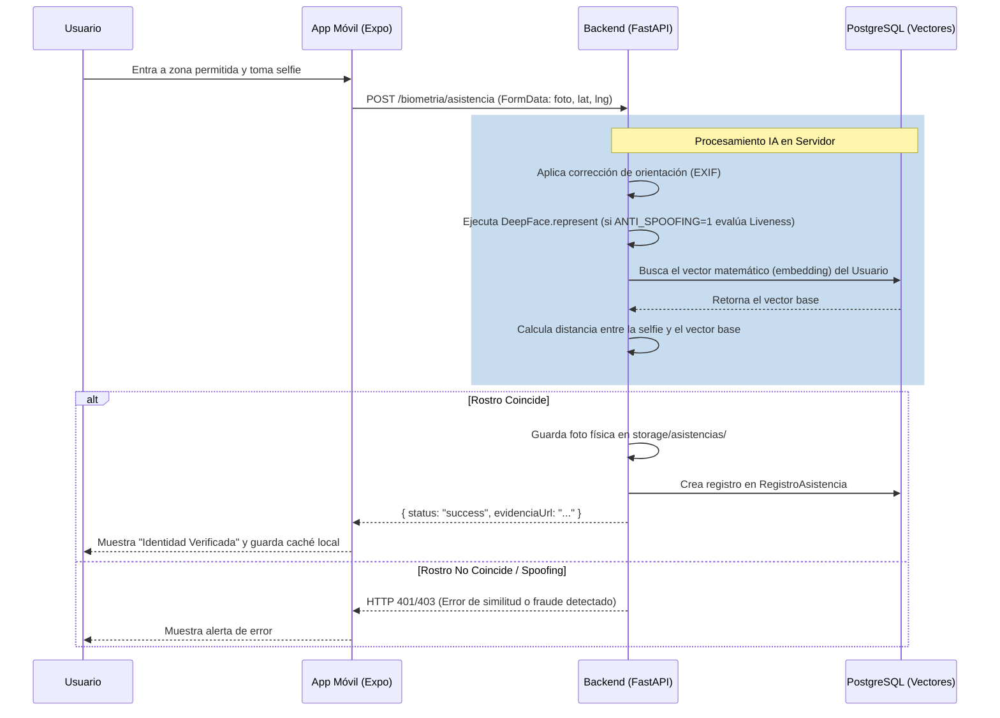

# Arquitectura Técnica de Autenticación Facial (Móvil)

Este documento describe la arquitectura de la aplicación móvil (React Native + Expo) y su interacción con el servidor central (`backend_v2`) para el proceso de reconocimiento facial y marcaje de asistencia.

## 1. Estado Global y Contexto

El estado global de la aplicación móvil se maneja mediante React Context y AsyncStorage para persistencia local de configuraciones y caché temporal.

### Datos Manejados Localmente:
- **Perfiles (Caché):** Información básica del usuario (`id`, `name`, `photoUrl`).
- **Zonas:** Definición de geocercas (`lat`, `lng`, `radius`).
- **Check-ins (Caché):** Historial reciente de asistencias para visualización offline/rápida.
- **Configuraciones:** URL del servidor (configurable desde Ajustes) y roles de usuario.

*Nota:* A diferencia de versiones anteriores, **los vectores matemáticos (embeddings) ya no se almacenan en el celular**. Todo el procesamiento biométrico pesado se delegó al servidor central por razones de seguridad y rendimiento.

## 2. Motor de Reconocimiento Facial (Servidor Central)

La aplicación ya no depende de un servidor Flask independiente. Ahora se integra directamente con el ecosistema principal del proyecto (`backend_v2`):

- **Framework:** FastAPI (Python 3.10+).
- **Librería de IA:** DeepFace (por defecto usando el modelo `Facenet`).
- **Base de Datos:** PostgreSQL (almacena los vectores de rostros en la tabla `EmbeddingFacial`).
- **Almacenamiento de Fotos:** Sistema de archivos local del servidor (`storage/perfiles` y `storage/asistencias`).
- **Anti-Spoofing:** Soportado y configurable vía entorno (`ANTI_SPOOFING=0|1`) para rechazar fotos de fotos.

### Endpoints Principales consumidos por la App:
- `POST /api/v2/biometria/enrolar`: Recibe una foto (FormData), detecta el rostro, calcula el embedding de 512 dimensiones y lo guarda en PostgreSQL.
- `POST /api/v2/biometria/asistencia`: Recibe la selfie (FormData) y las coordenadas GPS actuales. El servidor calcula el embedding de la selfie y lo compara mediante distancia de similitud (L2/Coseno) contra el perfil del usuario autenticado.

## 3. Geolocalización (Geofencing)

El proceso de verificación de geocerca ocurre en dos capas (Frontend y Backend):

### Capa Móvil (Hook `useLocation.ts`):
- Usa `expo-location` con alta precisión.
- Calcula la distancia usando la fórmula de **Haversine**.
- Si el usuario no está dentro del radio permitido (`isInZone`), la UI bloquea el botón de tomar la foto.

### Capa Servidor:
- La aplicación envía la `latitud`, `longitud` y `zona_id` al endpoint de asistencia.
- El servidor guarda estas coordenadas junto con la foto de evidencia, permitiendo posteriores auditorías geográficas desde el Portal Web Administrativo.

## 4. Flujo de Datos Actualizado: Registro de Asistencia

## 5. Integración Frontend-Backend (faceApi.ts)

El archivo `src/services/faceApi.ts` maneja las peticiones HTTP (Axios/Fetch) con el servidor:
- Usa `FormData` nativo de React Native para subir imágenes sin convertirlas a Base64 masivos (mejorando el rendimiento de red).
- Permite configurar la dirección IP del servidor central manualmente desde la pantalla de ajustes de la app para pruebas en LAN.
- Retorna excepciones personalizadas que la UI captura para mostrar notificaciones amigables.

## 6. Perspectiva de Optimizaciones Futuras

- **Modo Offline:** Implementar una cola local (SQLite o AsyncStorage) para que si no hay red, la foto y las coordenadas se guarden temporalmente en el celular y se envíen al servidor en background al recuperar la conexión.
- **Compresión de Imagen:** Reducir la resolución de la imagen tomada con `expo-camera` a 800x600 o similar *antes* de enviarla por la red, disminuyendo significativamente la carga de RAM del servidor al ejecutar la IA.
