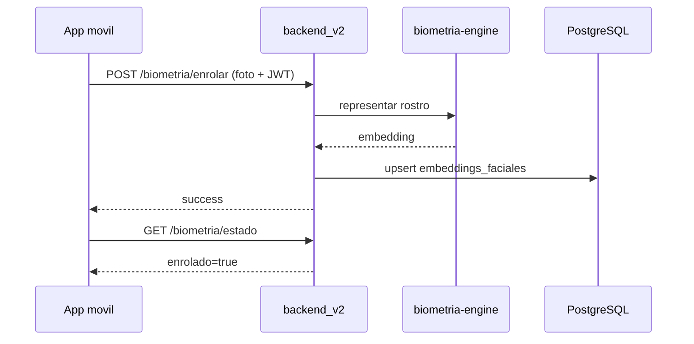
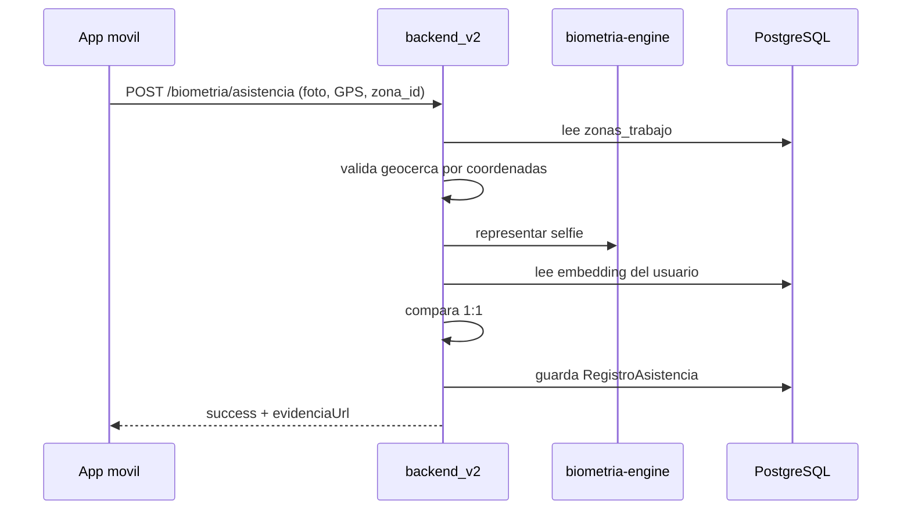

# Arquitectura Tecnica GeoFace Movil

## 1. Capas

```text
App Expo (`movil/`)
  -> API central (`backend_v2`, FastAPI, /api/v2)
    -> Servicio interno `biometria-engine`
    -> PostgreSQL + storage/perfiles + storage/asistencias
```

La app movil solo captura datos y muestra estados. La autoridad esta en backend.

## 2. Estado Local

`AppContext` mantiene:

- `biometricStatus`: estado oficial consultado en `/biometria/estado`.
- `zones`: zonas oficiales sincronizadas desde `/biometria/zonas`.
- `checkIns`: historial visual reciente.
- `threshold`: preferencia visual local.
- `locationState`: GPS y geocerca local.

La cache local no sustituye validaciones backend.

## 3. Autenticacion

- Login: `POST /api/v2/auth/login`.
- Token: SecureStore en nativo, AsyncStorage en web.
- Usuario actual: `GET /api/v2/auth/yo`.
- Endpoints protegidos usan `Authorization: Bearer <token>`.
- Creacion/eliminacion de usuarios desde movil esta bloqueada.

## 4. Biometria

### Enrolamiento



### Asistencia



## 5. Geocerca

La app calcula zona cercana para UX. El backend valida la geocerca de nuevo antes de procesar la imagen.

Reglas actuales:

- Si hay zonas oficiales y las coordenadas no caen en ninguna, backend responde `400`.
- Si hay solapes, backend usa la zona mas cercana.
- Si no hay zonas oficiales, queda pendiente decision funcional/productiva.

## 6. Evidencias

El backend expone evidencia por:

`GET /api/v2/biometria/evidencia/{filename}`

Controles:

- Requiere JWT y permiso `biometria`.
- Solo dueño o admin puede ver la evidencia.
- La app solo acepta rutas relativas seguras bajo `/api/v2/biometria/evidencia/`.
- La app descarga con Authorization y no usa tokens en query params.
- En nativo, convierte temporal a data URI y borra el archivo descargado.

## 7. Infraestructura

- `docker-compose.yml` local contiene `biometria-engine`.
- Produccion/Pruebas3 deben validar que `biometria-engine` exista en compose, red interna y sin puerto publico.
- `usesCleartextTraffic=true` solo es aceptable para piloto LAN documentado; produccion requiere HTTPS/VPN.

## 8. Legacy

`movil/face-server/` contiene el servidor Flask/DeepFace historico. No es parte del runtime productivo actual. Se mantiene temporalmente como referencia historica hasta eliminarlo o archivarlo formalmente.
